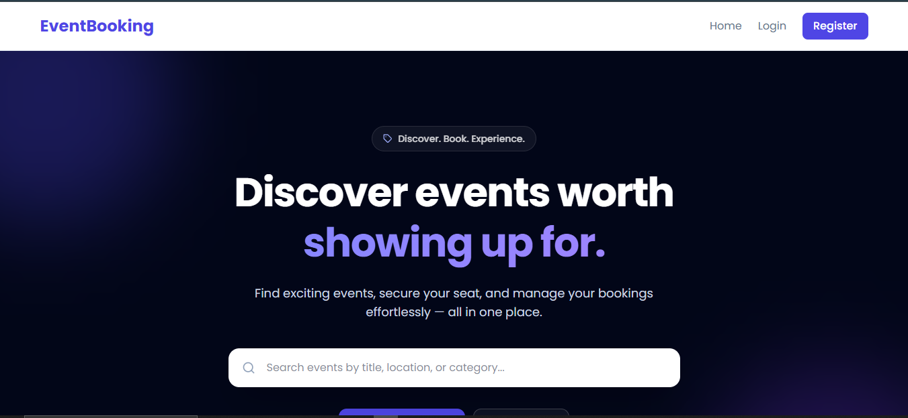
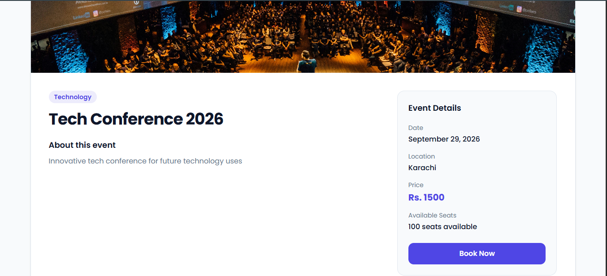
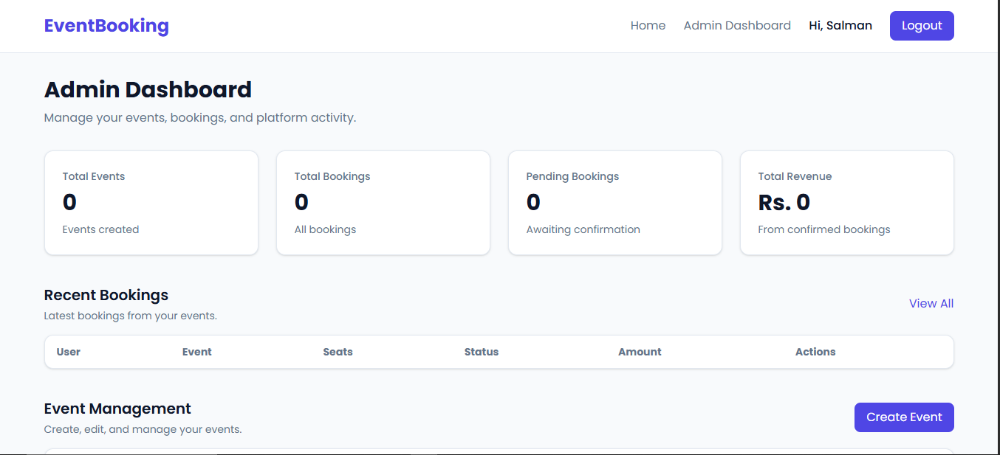
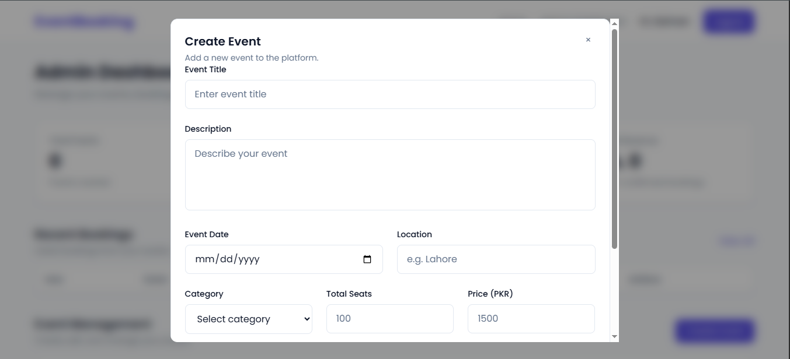

# EventBooking

A full-stack event booking platform built with the MERN stack. Users can discover events, create bookings, verify bookings through OTP, and manage their bookings. Administrators can manage events, review bookings, approve or reject requests, and monitor booking statistics.

## Live Demo

**Frontend:**
https://event-booking-beta-nine.vercel.app/

**Backend API:**
https://event-booking-30rq.onrender.com/

**GitHub Repository:**
https://github.com/salmanbintariq/event-booking

---

## Screenshots

### Home Page



### Event Details & Booking



### Admin Dashboard



### Event Form



---

## Features

### User Features

* User registration and login
* Email OTP verification
* JWT authentication using HTTP-only cookies
* Browse upcoming events
* Search events by title, location, or category
* View detailed event information
* Select the number of seats
* Create event bookings
* Booking OTP verification
* View personal bookings
* Track booking and payment status
* Cancel bookings

### Admin Features

* Admin-only protected dashboard
* Create events
* Upload event images
* Edit events
* Delete events when allowed
* View all bookings
* Confirm bookings
* Reject bookings
* Monitor available seats
* View total bookings and revenue statistics

### Additional Features

* Cloudinary image uploads
* MongoDB database
* Responsive React interface
* Protected frontend routes
* Role-based authorization
* Production deployment with Vercel and Render

---

## Booking Flow

The booking system follows this flow:

```text
User selects an event
        ↓
Select number of seats
        ↓
Create booking
        ↓
Booking becomes Pending
        ↓
Booking OTP is sent
        ↓
User verifies OTP
        ↓
Admin reviews booking
        ↓
   ┌────┴────┐
   ↓         ↓
Confirm    Reject
   ↓         ↓
Confirmed  Rejected
```

A pending booking reserves the selected seats. If the booking is rejected or cancelled, those seats are returned to the event.

Payment processing is intentionally not included in the current version.

---

## Authentication

Authentication uses JWT stored in an HTTP-only cookie.

The authentication flow is:

```text
Register
   ↓
Account OTP
   ↓
Verify Account
   ↓
Login
   ↓
JWT HTTP-only Cookie
   ↓
Protected Routes
```

The backend also uses role-based authorization:

```text
User
 ├── My Bookings
 └── Create/View Bookings

Admin
 ├── Event Management
 ├── Booking Management
 └── Dashboard Statistics
```

Frontend route protection improves the user experience, while the backend middleware remains the actual authorization layer.

---

## Tech Stack

### Frontend

* React
* Vite
* React Router
* Tailwind CSS
* Axios
* React Icons

### Backend

* Node.js
* Express.js
* MongoDB
* Mongoose
* JWT
* bcryptjs
* Nodemailer
* Multer
* Cloudinary
* cookie-parser
* CORS

### Deployment

* **Frontend:** Vercel
* **Backend:** Render
* **Database:** MongoDB Atlas
* **Image Storage:** Cloudinary

---

## Project Structure

```text
event-booking/
│
├── backend/
│   ├── src/
│   │   ├── config/
│   │   ├── controllers/
│   │   ├── middleware/
│   │   ├── models/
│   │   ├── routes/
│   │   └── utils/
│   │
│   ├── .env
│   ├── .gitignore
│   ├── index.js
│   └── package.json
│
├── frontend/
│   ├── src/
│   │   ├── api/
│   │   ├── components/
│   │   ├── context/
│   │   ├── pages/
│   │   └── ...
│   │
│   ├── .env
│   ├── .gitignore
│   ├── package.json
│   └── vite.config.js
│
├── screenshots/
│   ├── 1.png
│   ├── 2.png
│   ├── 3.png
│   └── 4.png
│
└── README.md
```

---

## API Overview

### Authentication

| Method | Endpoint               | Description            |
| ------ | ---------------------- | ---------------------- |
| POST   | `/api/auth/register`   | Register a new user    |
| POST   | `/api/auth/login`      | Login user             |
| POST   | `/api/auth/verify-otp` | Verify account OTP     |
| GET    | `/api/auth/me`         | Get authenticated user |
| POST   | `/api/auth/logout`     | Logout user            |

### Events

| Method | Endpoint          | Description       |
| ------ | ----------------- | ----------------- |
| GET    | `/api/events`     | Get all events    |
| GET    | `/api/events/:id` | Get event details |
| POST   | `/api/events`     | Create event      |
| PUT    | `/api/events/:id` | Update event      |
| DELETE | `/api/events/:id` | Delete event      |

Event creation, editing, and deletion require admin authorization.

### Bookings

| Method | Endpoint                    | Description                 |
| ------ | --------------------------- | --------------------------- |
| POST   | `/api/bookings`             | Create booking              |
| POST   | `/api/bookings/send-otp`    | Send booking OTP            |
| POST   | `/api/bookings/verify-otp`  | Verify booking OTP          |
| GET    | `/api/bookings/my`          | Get current user's bookings |
| GET    | `/api/bookings`             | Get all bookings            |
| GET    | `/api/bookings/admin-stats` | Get admin statistics        |
| PUT    | `/api/bookings/:id/confirm` | Confirm booking             |
| PUT    | `/api/bookings/:id/reject`  | Reject booking              |
| DELETE | `/api/bookings/:id`         | Cancel booking              |

Admin-only booking endpoints are protected with authentication and role-based authorization middleware.

---

## Environment Variables

### Backend

Create a `.env` file inside the `backend` directory:

```env
MONGO_URI=your_mongodb_connection_string
JWT_SECRET=your_jwt_secret

EMAIL_USER=your_email
EMAIL_PASS=your_email_app_password

CLOUDINARY_CLOUD_NAME=your_cloudinary_cloud_name
CLOUDINARY_API_KEY=your_cloudinary_api_key
CLOUDINARY_API_SECRET=your_cloudinary_api_secret

FRONTEND_URL=http://localhost:5173
```

### Frontend

Create a `.env` file inside the `frontend` directory:

```env
VITE_API_URL=http://localhost:5000/api
```

For production, the frontend uses the deployed Render API:

```env
VITE_API_URL=https://event-booking-30rq.onrender.com/api
```

**Never commit `.env` files or secret credentials to GitHub.**

---

## Installation

### 1. Clone the repository

```bash
git clone https://github.com/salmanbintariq/event-booking.git

cd event-booking
```

### 2. Install backend dependencies

```bash
cd backend
npm install
```

### 3. Configure backend environment variables

Create:

```text
backend/.env
```

and add the required variables.

### 4. Start the backend

```bash
npm run dev
```

The backend will run on:

```text
http://localhost:5000
```

### 5. Install frontend dependencies

Open another terminal:

```bash
cd frontend
npm install
```

### 6. Configure frontend environment variables

Create:

```text
frontend/.env
```

and add:

```env
VITE_API_URL=http://localhost:5000/api
```

### 7. Start the frontend

```bash
npm run dev
```

The frontend will run on the Vite development URL, usually:

```text
http://localhost:5173
```

---

## Security

The project includes several security-related practices:

* Password hashing with bcrypt
* JWT authentication
* HTTP-only authentication cookies
* Protected backend routes
* Role-based admin authorization
* OTP verification
* Environment variables for secrets
* Backend validation for booking and event operations
* CORS configuration for the production frontend
* File upload size limits for event images

---

## Seat Management

The booking system maintains event seat availability.

For example:

```text
Total Seats:      100
Available Seats:   95
Booked Seats:       5
```

When a booking is created:

```text
Available Seats -= Requested Seats
```

If the booking is rejected or cancelled:

```text
Available Seats += Booking Seats
```

The system also prevents an event's total seats from being reduced below the number of already booked seats.

---

## Event Deletion

Events with existing bookings cannot be deleted.

This protects historical booking records and prevents bookings from referencing deleted events.

```text
Event
  ↓
Has bookings?
  ├── Yes → Deletion blocked
  └── No  → Event can be deleted
```

---

## Deployment

The application is deployed using a separated frontend/backend architecture.

```text
                    GitHub
                       │
              ┌────────┴────────┐
              ↓                 ↓
          Vercel              Render
       React Frontend       Express Backend
                                │
                         ┌──────┴──────┐
                         ↓             ↓
                    MongoDB Atlas   Cloudinary
```

### Frontend

The React/Vite application is deployed on Vercel.

### Backend

The Node/Express API is deployed on Render.

### Database

MongoDB Atlas stores users, OTP records, events, and bookings.

### Image Storage

Cloudinary stores uploaded event images.

---

## Future Improvements

Potential future improvements include:

* Online payment integration
* Booking confirmation email with complete event details
* Event pagination
* Advanced event filtering
* Event categories management
* Admin event analytics
* User profile management
* Booking history improvements
* Better form validation and error handling
* Automated testing
* Improved accessibility

---

## Author

**Muhammad Salman Tariq**

BS Information Technology

GitHub:
https://github.com/salmanbintariq

Email:
[salmantariq8018@gmail.com](mailto:salmantariq8018@gmail.com)

---


